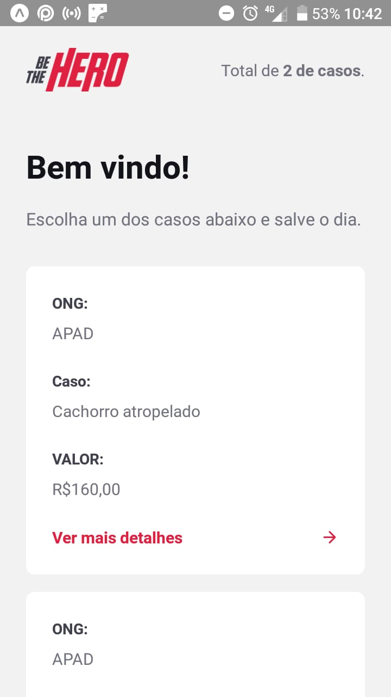

# Be The Hero
Be The Hero foi um aplicativo desenvolvido usando NodeJS, ReactJS e React Native para apoio a ONGs cuidadoras de animais desenvolvido durante a semana omnistack 11 da [Rocketseat](https://Rocketseat.com.br).

## Como funciona:

Na aplicação web as ONGs se cadastram e cadastram os casos a serem disponibilizados na aplicação mobile onde os usuários podem visualizar e escolher um caso para patriocinar entrando em contato por whatsapp com a ONG.
Use the package manager to install foobar.

## Preview



## Contribuição
```bash
Fique a vontade para contribuir com o aplicativo.
```

## License
Original de [Rocketseat](https://Rocketseat.com.br). 
